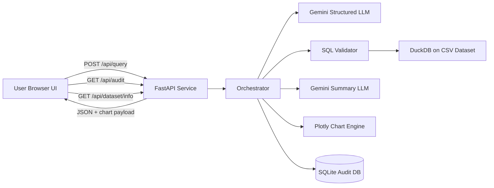
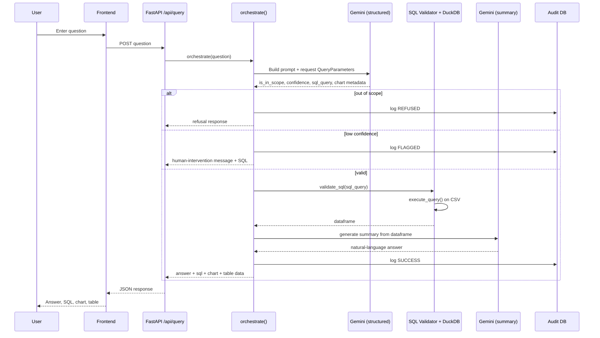

# Doc.Chat

This repository contains `Doc_Chat.ipynb`, a Colab-first prototype for querying a road-safety CSV dataset with natural language using Gemini, DuckDB, FastAPI, and a web UI.

## 1. How to deploy

### Prerequisites
- Google Colab runtime
- Gemini API key (`GEMINI_API_KEY`)
- ngrok auth token (`NGROK_AUTH_TOKEN`)

### Deployment steps
1. Open `Doc_Chat.ipynb` from this repository in Google Colab.
2. Add both secrets in Colab **Secrets**:
   - `GEMINI_API_KEY`
   - `NGROK_AUTH_TOKEN`
3. Run notebook cells in order:
   - install dependencies
   - load/download dataset
   - initialize schema, SQL engine, orchestration, API, and frontend
4. Run the **Launch** cell to start Uvicorn and create an ngrok tunnel.
5. Open the printed **Frontend URL** to use Doc.Chat, and `/docs` for FastAPI docs.

---

## 2. Architecture diagram

---

## 3. Query data flow and control flow diagram

